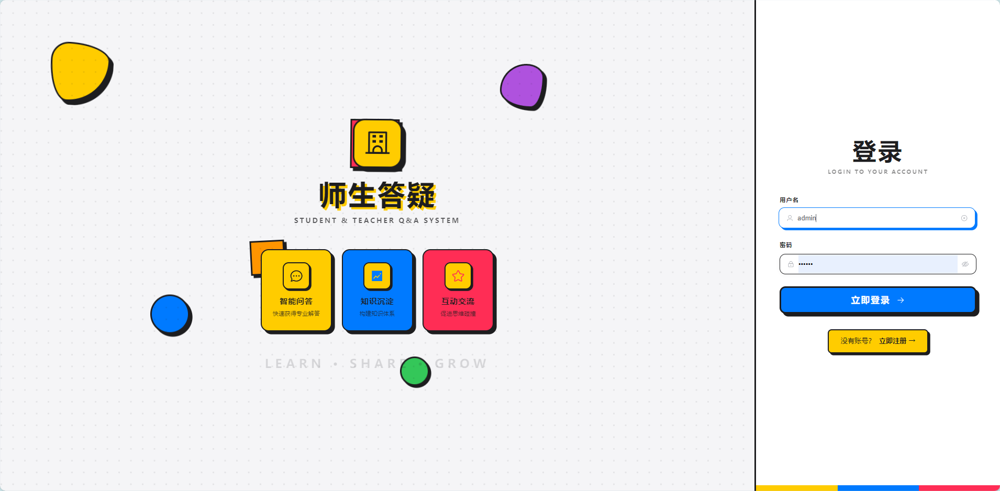
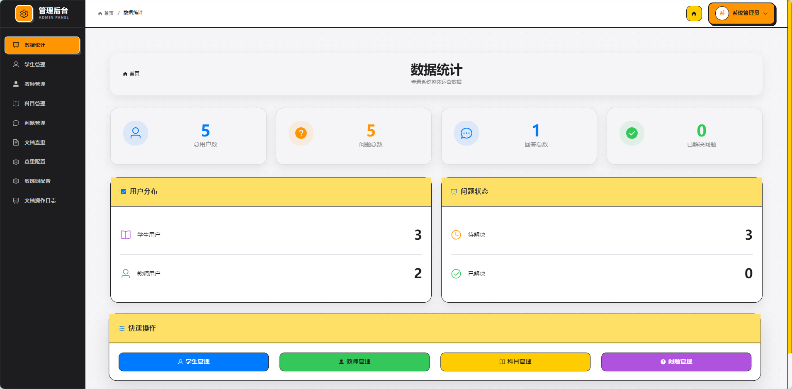
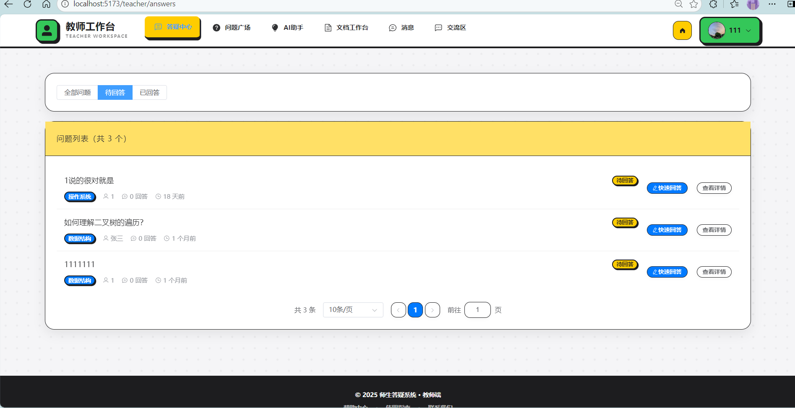
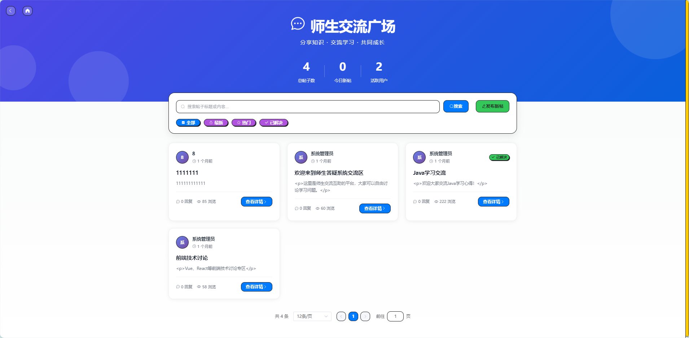
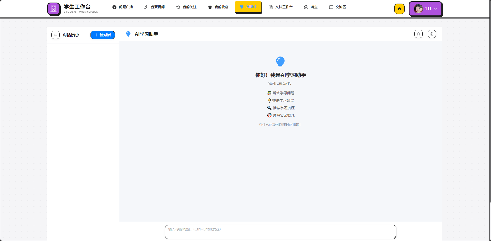
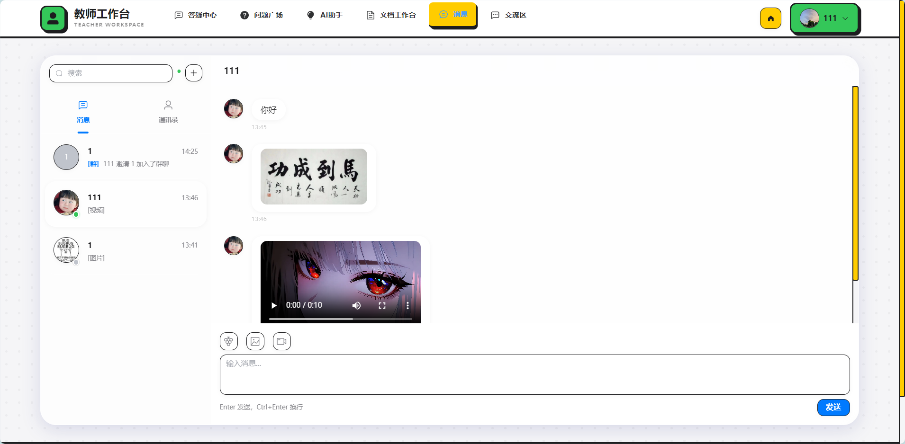
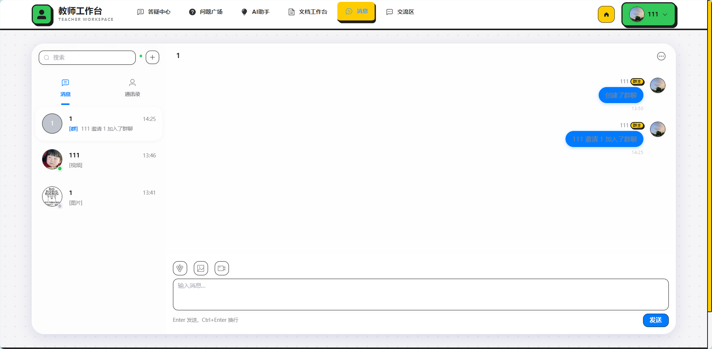
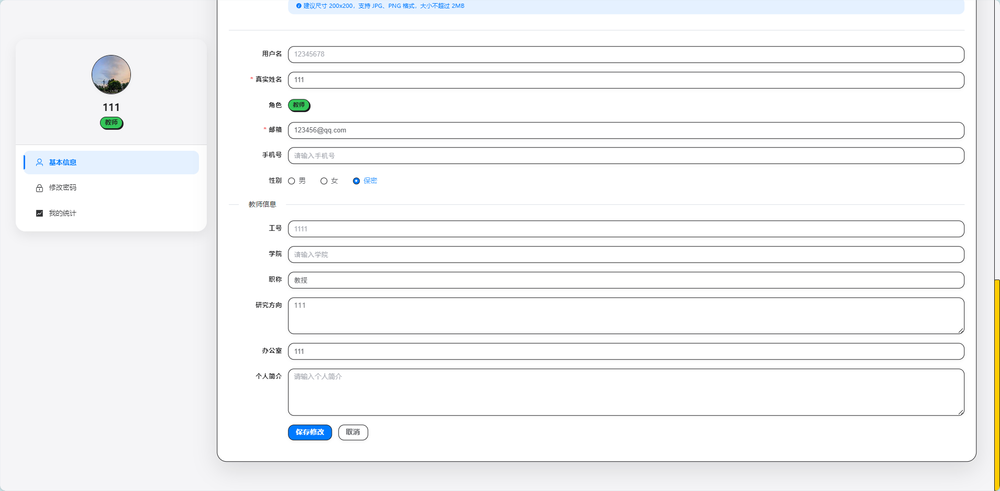

<p align="center">
  
</p>

<h1 align="center">🎓 师生答疑系统 (Student-Teacher Q&A System)</h1>

<p align="center">
  <strong>一站式智能教学交互平台 | AI驱动的现代化答疑解决方案</strong>
</p>

<p align="center">
  
  
  
  
  
  
</p>

<p align="center">
  <a href="#-功能特性">功能特性</a> •
  <a href="#-技术栈">技术栈</a> •
  <a href="#-快速开始">快速开始</a> •
  <a href="#-项目截图">项目截图</a> •
  <a href="#-项目结构">项目结构</a>
</p>

---

## 📖 项目简介

**师生答疑系统**是一款专为高校/教育机构设计的智能化教学交互平台，集成了**问答管理**、**AI智能助手**、**实时聊天**、**论坛交流**、**文档降重**等多项功能，旨在打造高效、便捷的师生互动体验。

### 🎯 核心亮点

-   **AI 智能助手** - 基于 LangChain4j + 大语言模型，提供智能答疑、学习辅导
- 💬 **实时通讯** - WebSocket 支持的即时聊天，支持私聊、群聊、图片/视频消息
- 📝 **AI 文档降重** - 智能论文查重与改写，流式输出实时预览
- 🏛️ **交流广场** - 类知乎的论坛系统，支持帖子、评论、点赞、收藏
- 📊 **后台管理** - 完善的管理后台，数据统计一目了然

---

## ✨ 功能特性

### 👨‍🎓 学生端

| 功能模块 | 描述 |
|---------|------|
| 📚 问题广场 | 浏览所有问题，按科目/状态筛选 |
| ✏️ 我要提问 | 发布问题，支持富文本、代码高亮 |
| ⭐ 我的关注 | 关注的教师、收藏的问题 |
| 🤖 AI 助手 | 智能学习助手，即时解答疑问 |
| 📄 文档工作台 | AI 文档查重与智能降重改写 |
| 💬 即时通讯 | 私聊教师、加入群聊交流 |
| 🏛️ 交流广场 | 发帖讨论、知识分享 |

### 👨‍🏫 教师端

| 功能模块 | 描述 |
|---------|------|
| 📋 答疑中心 | 查看待回答问题，快速响应 |
| 📊 问题广场 | 浏览全部问题动态 |
| 🤖 AI 助手 | 辅助备课、生成答案参考 |
| 📄 文档工作台 | 论文批阅辅助、查重检测 |
| 💬 即时通讯 | 与学生私聊、管理群组 |
| 🏛️ 交流广场 | 发布学术讨论、课程通知 |

### 🛠️ 管理后台

| 功能模块 | 描述 |
|---------|------|
| 📈 数据统计 | 用户数、问题数、回答率等可视化 |
| 👥 学生管理 | 学生账号管理、信息维护 |
| 👨‍🏫 教师管理 | 教师信息管理、权限配置 |
| 📚 科目管理 | 学科分类管理 |
| ❓ 问题管理 | 问题审核、违规处理 |
| 📄 文档审核 | 敏感词管理、文档记录 |
| 🏛️ 论坛管理 | 帖子审核、评论管理 |

---

## 🖼️ 项目截图

### 登录页面
> 现代化 Neo-Brutalism 设计风格，支持学生/教师/管理员多角色登录



### 管理后台 - 数据统计
> 系统运营数据一目了然，支持快捷操作入口



### 教师答疑中心
> 教师可查看所有待回答问题，支持快速回复和问题过滤



### 师生交流广场
> 类知乎的论坛系统，支持发帖、评论、点赞、分类筛选



### AI 学习助手
> 基于大语言模型的智能助手，支持多轮对话、学习辅导



### AI 文档降重工作台
> 上传 Word 文档，AI 自动查重并提供智能改写建议


### 即时通讯
> 支持私聊、群聊，发送文字、图片、视频消息



### 聊天对话
> 实时消息推送，支持表情、已读状态、消息撤回



### 个人资料编辑
> 完善的个人信息管理，支持头像上传、资料修改



---

## 🛠️ 技术栈

### 后端技术

| 技术 | 版本 | 说明 |
|-----|------|------|
| Spring Boot | 3.1.5 | 核心框架 |
| Spring Security | 6.x | 安全认证 |
| Spring WebSocket | - | 实时通讯 |
| MyBatis-Plus | 3.5.7 | ORM框架 |
| MySQL | 8.0 | 数据存储 |
| Redis | 7.0 | 缓存/会话 |
| JWT | 0.12.3 | Token认证 |
| LangChain4j | 0.35.0 | AI集成框架 |
| 腾讯云COS | 5.6.x | 文件存储 |

### 前端技术

| 技术 | 版本 | 说明 |
|-----|------|------|
| Vue.js | 3.4 | 渐进式框架 |
| Vite | 5.0 | 构建工具 |
| Element Plus | 2.5.4 | UI组件库 |
| Pinia | 2.1.7 | 状态管理 |
| Vue Router | 4.2.5 | 路由管理 |
| Axios | 1.6.5 | HTTP客户端 |
| WangEditor | 5.1 | 富文本编辑器 |
| Monaco Editor | 0.52 | 代码编辑器 |
| Day.js | 1.11 | 日期处理 |

---

## 🚀 快速开始

### 环境要求

- **JDK** 17+
- **Node.js** 18+
- **MySQL** 8.0+
- **Redis** 7.0+
- **Maven** 3.8+

### 1. 克隆项目

```bash
git clone https://github.com/your-username/qa-system.git
cd qa-system
```

### 2. 后端配置

```bash
cd qa-system-backend

# 修改配置文件
cp src/main/resources/application.yml.example src/main/resources/application.yml

# 配置数据库、Redis、AI服务等参数
vim src/main/resources/application.yml
```

**主要配置项：**

```yaml
spring:
  datasource:
    url: jdbc:mysql://localhost:3306/qa_system?useSSL=false&serverTimezone=Asia/Shanghai
    username: root
    password: your_password
  
  redis:
    host: localhost
    port: 6379

# AI 配置 (可选)
ai:
  openai:
    api-key: your_api_key
    base-url: https://api.openai.com/v1
```

```bash
# 启动后端
mvn spring-boot:run
```

### 3. 前端配置

```bash
cd qa-system-frontend

# 安装依赖
npm install

# 启动开发服务器
npm run dev
```

### 4. 访问系统

- **前端地址**: http://localhost:5173
- **后端接口**: http://localhost:8080/api
- **默认管理员**: admin / admin123

---

## 📁 项目结构

```
qa-system/
├── qa-system-backend/              # 后端项目
│   ├── src/main/java/com/qasystem/
│   │   ├── config/                 # 配置类
│   │   ├── controller/             # 控制器
│   │   │   ├── AuthController      # 认证登录
│   │   │   ├── QuestionController  # 问题管理
│   │   │   ├── AnswerController    # 回答管理
│   │   │   ├── ChatController      # 聊天通讯
│   │   │   ├── ForumController     # 论坛交流
│   │   │   ├── DocController       # 文档降重
│   │   │   ├── AiAssistantController # AI助手
│   │   │   └── AdminController     # 后台管理
│   │   ├── entity/                 # 实体类
│   │   ├── mapper/                 # 数据层
│   │   ├── service/                # 业务层
│   │   └── websocket/              # WebSocket处理
│   └── src/main/resources/
│       └── application.yml         # 配置文件
│
├── qa-system-frontend/             # 前端项目
│   ├── src/
│   │   ├── api/                    # API接口
│   │   ├── assets/                 # 静态资源
│   │   ├── components/             # 公共组件
│   │   ├── router/                 # 路由配置
│   │   ├── stores/                 # 状态管理
│   │   └── views/                  # 页面视图
│   │       ├── admin/              # 管理后台
│   │       ├── student/            # 学生端
│   │       ├── teacher/            # 教师端
│   │       ├── forum/              # 论坛模块
│   │       └── common/             # 公共页面
│   └── package.json
│
├── pictures/                       # 项目截图
└── README.md                       # 项目文档
```

---

## 🔧 核心功能实现

### AI 智能助手

基于 **LangChain4j** 框架集成大语言模型，支持：

- 多轮对话上下文管理
- 流式输出实时响应
- 对话历史持久化
- 自定义 System Prompt

### 实时通讯系统

基于 **WebSocket** 实现的即时通讯：

- 私聊/群聊消息
- 图片、视频消息
- 在线状态实时同步
- 消息已读/撤回
- 群组管理（创建、邀请、踢人、转让）

### 文档降重系统

- Word 文档解析
- AI 段落级查重分析
- 智能改写建议
- 流式改写实时预览
- 改写结果导出

 
---

## 🤝 贡献指南

欢迎提交 Issue 和 Pull Request！

1. Fork 本仓库
2. 创建特性分支 (`git checkout -b feature/AmazingFeature`)
3. 提交更改 (`git commit -m 'Add some AmazingFeature'`)
4. 推送到分支 (`git push origin feature/AmazingFeature`)
5. 打开 Pull Request

---

## 📄 开源协议

本项目采用 [MIT License](LICENSE) 开源协议。

---

## 🙏 致谢

- [Spring Boot](https://spring.io/projects/spring-boot)
- [Vue.js](https://vuejs.org/)
- [Element Plus](https://element-plus.org/)
- [LangChain4j](https://github.com/langchain4j/langchain4j)
- [MyBatis-Plus](https://baomidou.com/)

---

<p align="center">
  <strong>⭐ 如果这个项目对你有帮助，请给一个 Star 支持一下！</strong>
</p>

<p align="center">
  Made with ❤️ by <a href="https://github.com/ZSPSTRIVE">ZSPSTRIVE</a>
</p>
